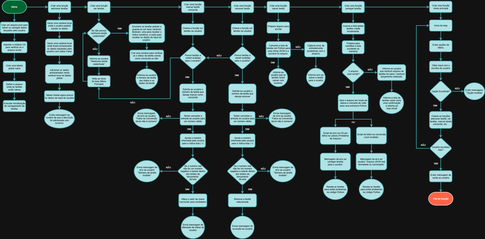

# 📚 Gerenciador de Tarefas em Python (CLI)

Este é um simples gerenciador de tarefas desenvolvido em Python, operado via linha de comando (CLI). Ele permite que o usuário adicione, visualize, marque como concluída e exclua tarefas, com a capacidade de salvar e carregar a lista de tarefas em um arquivo JSON.

---

## ✨ Funcionalidades

* **Adicionar Tarefa:** Inclua novas tarefas na lista.
* **Visualizar Tarefas:** Exiba todas as tarefas cadastradas, com seus respectivos números e status (concluída ou não).
* **Marcar Tarefa como Concluída:** Altere o status de uma tarefa de pendente para concluída.
* **Excluir Tarefa:** Remova tarefas da lista.
* **Persistência de Dados:** Salva e carrega a lista de tarefas automaticamente de um arquivo JSON (`lista_tarefas.json`), garantindo que suas tarefas não sejam perdidas ao fechar o programa.
* **Tratamento de Erros:** Lida com entradas inválidas do usuário (ex: digitar texto em vez de número).

---

## 🚀 Como Usar

1.  **Clone o Repositório:**
    ```bash
    git clone [https://github.com/Brenopsxky/Gerenciador-de-Tarefas.git](https://github.com/Brenopsxky/Gerenciador-de-Tarefas.git)
    cd Gerenciador-de-Tarefas
    ```

2.  **Execute o Programa:**
    ```bash
    python gerenciador_tarefas.py
    ```

3.  **Interaja via Terminal:**
    Siga as instruções exibidas no terminal para navegar entre as opções do menu (adicionar, ver, marcar, excluir, sair).

---

## 🛠️ Tecnologias Utilizadas

* **Python 3:** A linguagem de programação principal.
* **Módulo `json`:** Utilizado para salvar e carregar as tarefas em formato JSON, garantindo a persistência dos dados.

---

## 📊 Estrutura Lógica (Fluxograma)

A lógica central do programa segue o seguinte fluxo principal:



---

## 📈 Melhorias Futuras / Próximos Passos (MVP e Evolução)

Este projeto representa uma **Versão Mínima Viável (MVP)** do Gerenciador de Tarefas. As próximas melhorias planejadas incluem:

* **Persistência de Dados Aprimorada:** Garantir que todas as alterações (como exclusões) sejam salvas automaticamente ou que o usuário seja alertado para salvar antes de sair, evitando perda de dados.
* **Melhorias na Interface do Usuário (UX/UI):** Reduzir a poluição visual no terminal e, futuramente, explorar a criação de uma **Interface Gráfica do Usuário (GUI)** para uma experiência mais interativa.
* **Novas Funcionalidades:** Adicionar opções como prioridade de tarefas, datas de vencimento, filtragem e categorias.

---

## 👨‍💻 Autor

Breno Lisboa (Brenopsxky)
[https://www.linkedin.com/in/blisboa-tech/](https://www.linkedin.com/in/blisboa-tech/)  
[blisboa.tech@gmail.com](mailto:blisboa.tech@gmail.com)

---
